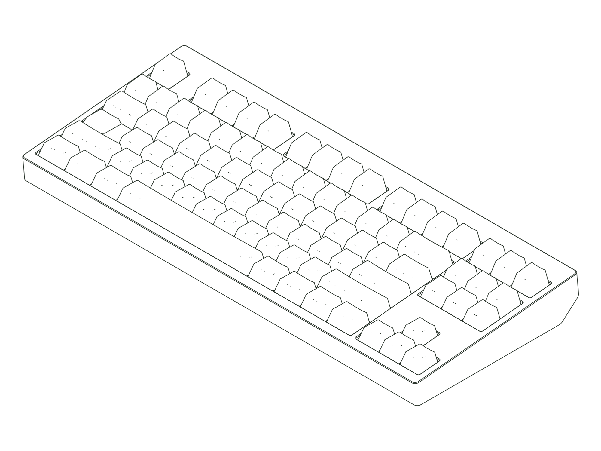

`Status: Legacy` · `Production Years: 2020–2021` · `Layout: TKL`

This is where Mode started. We revealed the Eighty on Geekhack's interest-check forums in September 2020: a TKL (tenkeyless) cut from anodized aluminum, with the top and bottom case halves joined into one clean side profile. It introduced our stack-mount, where the PCB, plate, and foam compress into a single quiet stack for a muted, lower pitched sound. This was offered as a 50-piece Founder's Edition with rose-gold bottoms, a 450-piece First Edition, then a larger standard run. It's what gave Mode the initial momentum to grow into what it is today.

## [:material-link: Components](components.md)
Every compatible part for this board, with version and availability details.

## [:material-link: Design Files](design-files.md)
CAD files you can use to have replacement or custom parts made.

## [:material-link: Community Projects](community-projects.md)
Community-created projects, modifications, and resources we've gathered.

## [:material-link: Build Guide](https://modedesigns.com/pages/eighty-guide-2020)
Step-by-step assembly instructions on modedesigns.com.
