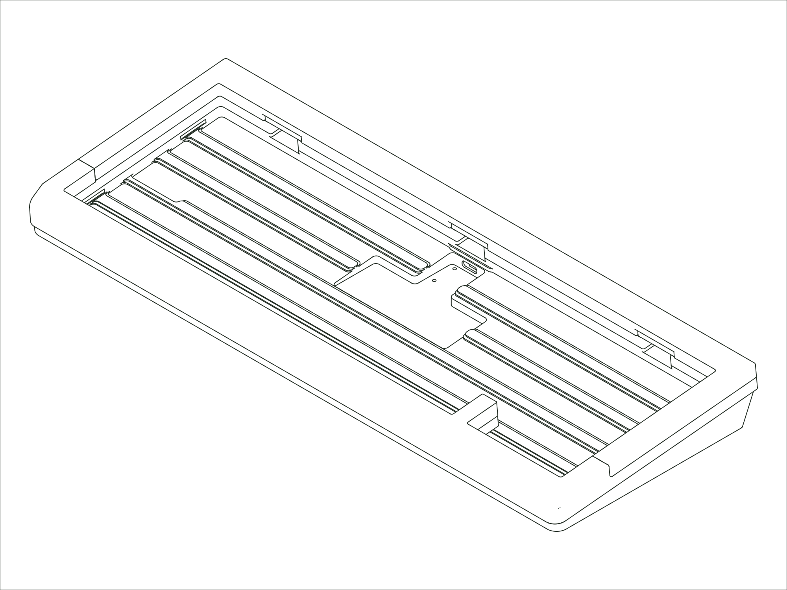

`Status: Legacy` · `Production Years: 2024–2025` · `Layout: 65%`

The Encore is our first board designed with someone outside Mode. Matthew Encina of Mod Musings drew it, we produced it, and the two of us spent about a year on it. The idea was a statement piece built on contrast: walnut, maple, and white-oak accents set against anodized aluminum, with thicker bezels and a cherry-lip chamfer along the front edge. It shares its internals with the SixtyFive but stands on its own. We released it as limited series rather than a standing product, including an Industrial Series in translucent materials and metal, capped at 450 units.

## [:material-link: Components](components.md)
Every compatible part for this board, with version and availability details.

## [:material-link: Design Files](design-files.md)
CAD files you can use to have replacement or custom parts made.

## [:material-link: Community Projects](community-projects.md)
Community-created projects, modifications, and resources we've gathered.

## [:material-link: Build Guide](https://modedesigns.com/pages/encore-guide)
Step-by-step assembly instructions on modedesigns.com.
