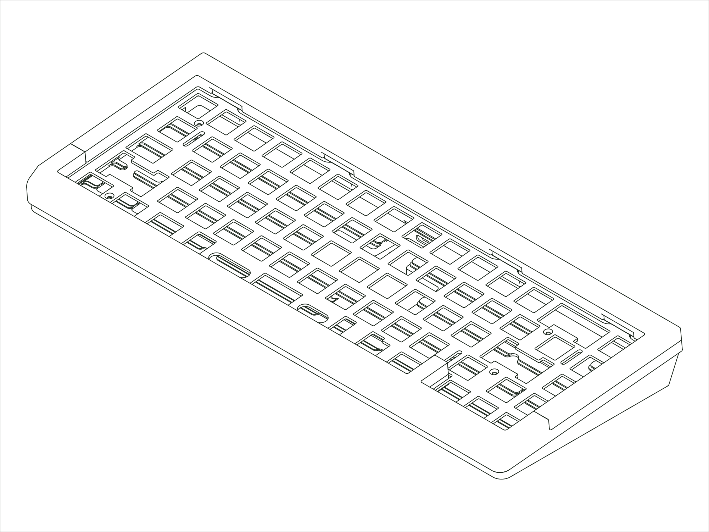

`Status: Current` · `Production Years: 2026–present` · `Layout: 65%`

The Encore moves from a limited collaboration into our permanent lineup. It keeps its mixed-material language: a split hardwood top plate in walnut, maple, or white oak over anodized aluminum, across five colorways. It's also the first of our boards to use the Crown Mounting System. Hi-fi-inspired spike feet and suede force-break pads keep unwanted sound characteristics out. It's the clearest expression yet of why we do this: the things you touch every day should be a joy to see, hear, and touch.

## [:material-link: Components](components.md)
Every compatible part for this board, with version and availability details.

## [:material-link: Design Files](design-files.md)
CAD files you can use to have replacement or custom parts made.

## [:material-link: Community Projects](community-projects.md)
Community-created projects, modifications, and resources we've gathered.
