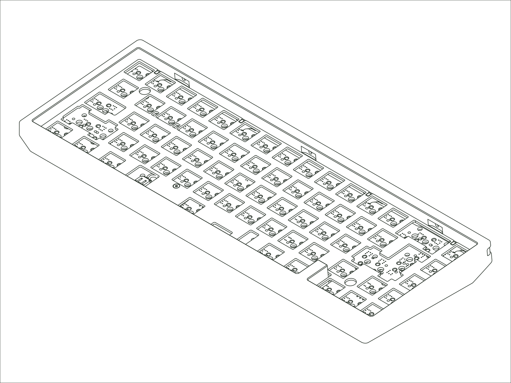

`Status: Legacy` · `Production Years: 2023–2025` · `Layout: 65%`

The Envoy is a refined take on the 65%: compact, heavier than it looks, with a floating side profile. It introduced our Lattice Mounting system, built around a new lattice block mount that suspends the assembly for a soft, cushioned keystroke and lets you tune the feel with different blocks. We launched it alongside our family of keycaps, switches, deskmats, and artisans. The lattice mount went on to be our primary mounting system for several years.

## [:material-link: Components](components.md)
Every compatible part for this board, with version and availability details.

## [:material-link: Design Files](design-files.md)
CAD files you can use to have replacement or custom parts made.

## [:material-link: Community Projects](community-projects.md)
Community-created projects, modifications, and resources we've gathered.

## [:material-link: Build Guide](https://modedesigns.com/pages/envoy-guide)
Step-by-step assembly instructions on modedesigns.com.
