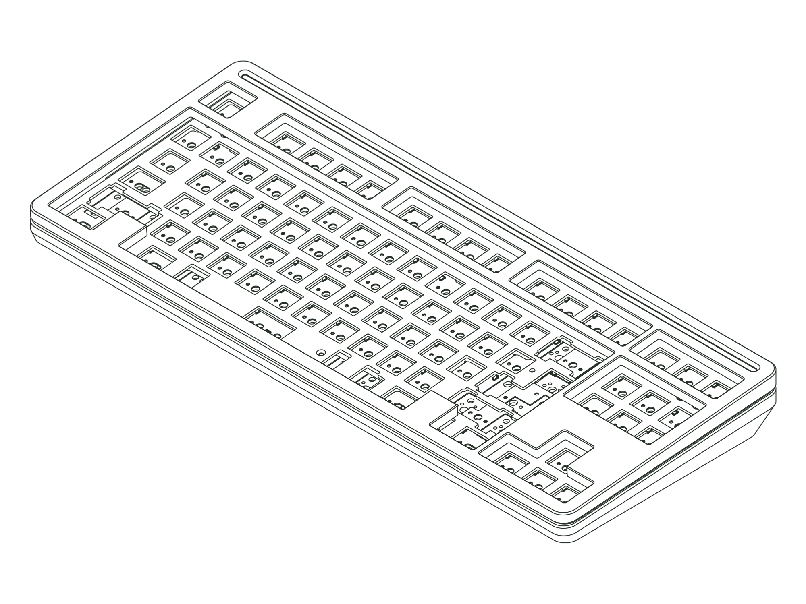

`Status: Legacy` · `Production Years: 2023-2025` · `Layout: TKL`

For the Loop, we rebuilt our tenkeyless from scratch. Only the PCB carried over from the Eighty. We drew on retro hi-fi and analog audio: the case split around a ring, the loop it was named for, an accent bar sat above the function row, and a large oval weight anchored the back behind press-in feet that hid the screws. It was offered in WKL and standard variants, and the lattice block mount came in three flex levels so you could set how soft or stiff it felt. We also tightened the mount into a more consistent stack that fixed the uneven sound some of our one-piece designs had. The Loop became our flagship TKL and the board where the lattice idea really grew up.

## [:material-link: Components](components.md)
Every compatible part for this board, with version and availability details.

## [:material-link: Design Files](design-files.md)
CAD files you can use to have replacement or custom parts made.

## [:material-link: Community Projects](community-projects.md)
Community-created projects, modifications, and resources we've gathered.

## [:material-link: Build Guide](https://modedesigns.com/pages/loop-guide)
Step-by-step assembly instructions on modedesigns.com.
