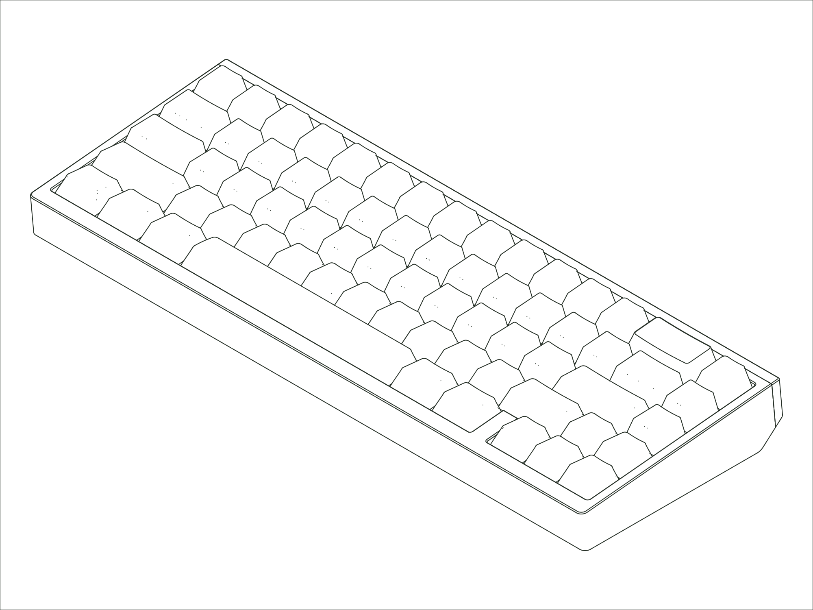

`Status: Legacy` · `Production Years: 2021–2022` · `Layout: 65%`

For our second board, we took the Eighty's quiet, angled look and brought it down to a 65%. We kept the in-house stack mount option, and added a top-mount option as well as the detail people remember it for: accent pieces that hold to the case with magnets. With this release we also rolled out the configurator tool that allowed for the selection of over a million different combinations of parts. It was the first of its kind for keyboards.

## [:material-link: Components](components.md)
Every compatible part for this board, with version and availability details.

## [:material-link: Design Files](design-files.md)
CAD files you can use to have replacement or custom parts made.

## [:material-link: Community Projects](community-projects.md)
Community-created projects, modifications, and resources we've gathered.

## [:material-link: Build Guide](https://modedesigns.com/pages/sixtyfive-guide)
Step-by-step assembly instructions on modedesigns.com.
