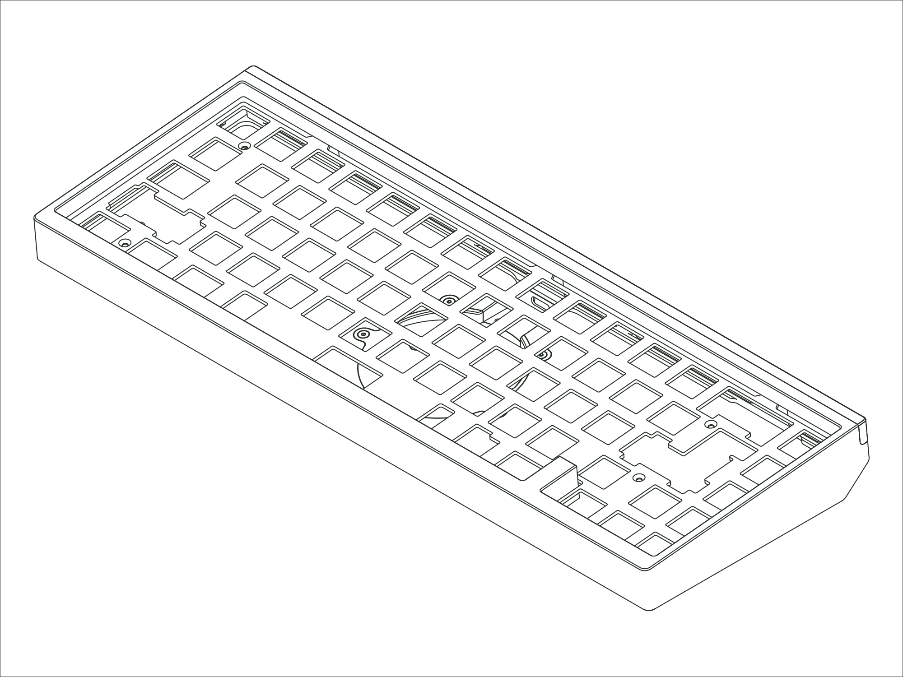

`Status: Legacy` · `Production Years: 2024–2025` · `Layout: 65%`

The 2024 SixtyFive brought one of our most well-received designs up to date. We kept the magnetic accent and the clean proportions, moved the internals to our current lattice block mount for tunable feel, and gave it a fresh set of colors and finishes.

## [:material-link: Components](components.md)
Every compatible part for this board, with version and availability details.

## [:material-link: Design Files](design-files.md)
CAD files you can use to have replacement or custom parts made.

## [:material-link: Community Projects](community-projects.md)
Community-created projects, modifications, and resources we've gathered.

## [:material-link: Build Guide](https://modedesigns.com/pages/sixtyfive-guide-2024)
Step-by-step assembly instructions on modedesigns.com.
