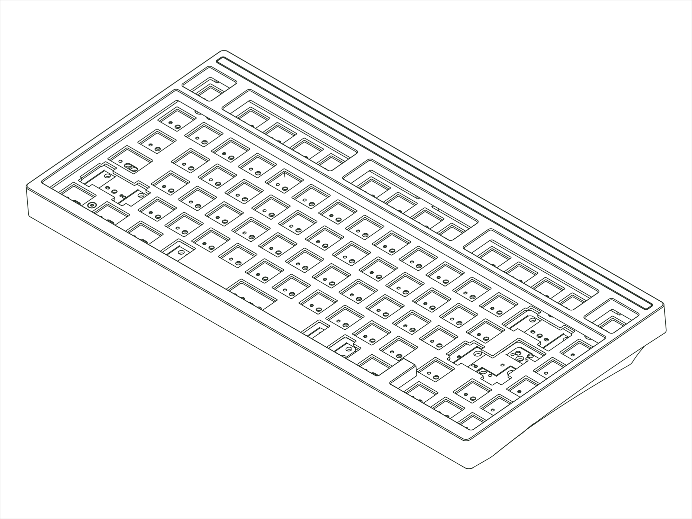

`Status: Current` · `Production Years: 2026–present` · `Layout: 75%`

The Sonnet returns for 2026, refined but not fundamentally changing its DNA. We looked at fitting our new Crown Mounting System, but it would have changed a shape that's become part of Mode's identity, so we left the silhouette and the Lattice Mount alone. We focused on tuning its sound profile and typing feel: a steel weight, microsuede force-break pads, and redesigned feet that calm the resonance and clean up the sound. It comes in five new colorways: Black Sesame, Forest Mocha, Studio Light, Golden Beige, and Steel Mushroom.

## [:material-link: Components](components.md)
Every compatible part for this board, with version and availability details.

## [:material-link: Design Files](design-files.md)
CAD files you can use to have replacement or custom parts made.

## [:material-link: Community Projects](community-projects.md)
Community-created projects, modifications, and resources we've gathered.
