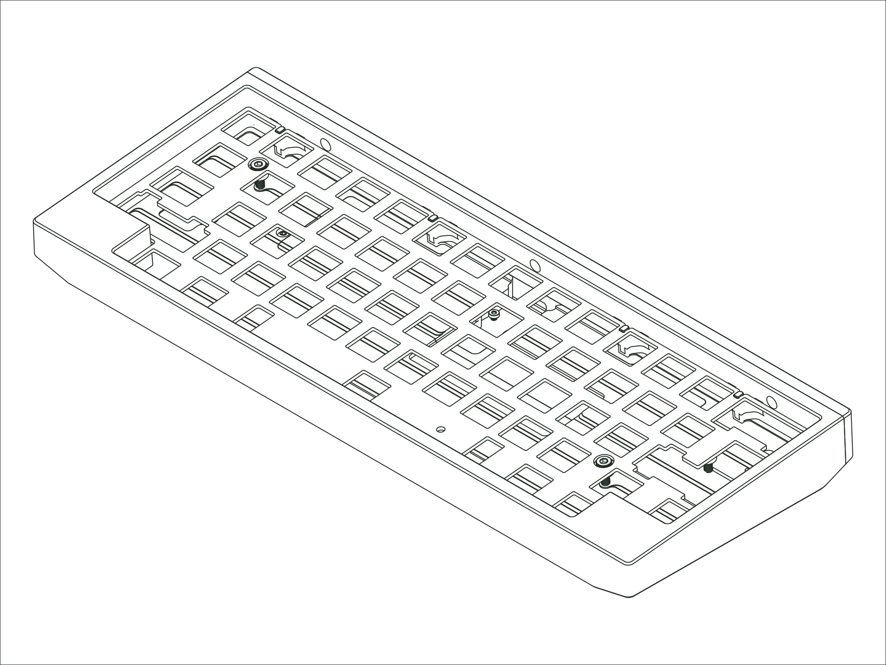

`Status: Legacy` · `Production Years: 2023–2025` · `Layout: 60%`

The Tempo was the most pared-back board we'd made. It was a 60% in a simple one-piece case with softened edges and one subtle accent at the back. Inside, our lattice block mount gave it a soft, forgiving keystroke, and the one-piece design kept it simple to build and tune. The Tempo was one of our most opinionated designs and was met with polarized opinions particularly in regards to the layout. That said, it holds a special place in our hearts.

## [:material-link: Components](components.md)
Every compatible part for this board, with version and availability details.

## [:material-link: Design Files](design-files.md)
CAD files you can use to have replacement or custom parts made.

## [:material-link: Community Projects](community-projects.md)
Community-created projects, modifications, and resources we've gathered.

## [:material-link: Build Guide](https://modedesigns.com/pages/tempo-build-guide)
Step-by-step assembly instructions on modedesigns.com.
