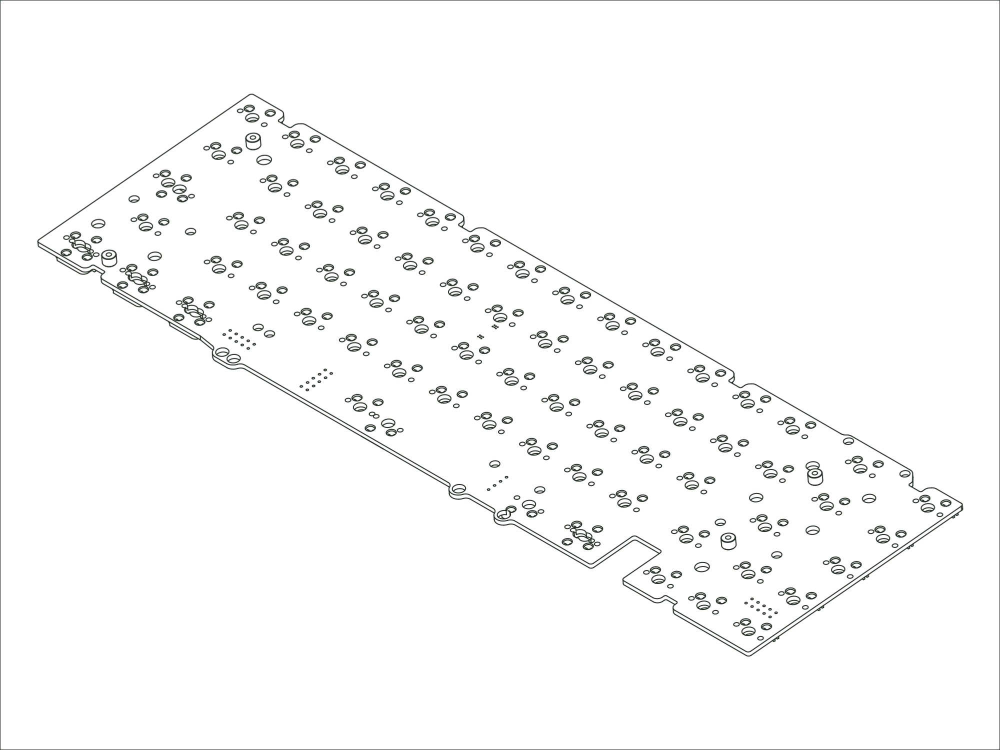

`2021 SixtyFive` `2024 SixtyFive` `Envoy` `2024 Encore`

## Availability

-   :material-store:{ .lg .middle } __Buy from Mode__

    ---

    Available for purchase directly from Mode.

    [:octicons-link-external-24: View product page](https://modedesigns.com/collections/all/products/sixtyfive-2021-feet){ target="_blank" rel="noopener" title="Buy from Mode (opens in new tab)" }

## Firmware

**Designator:** `M256-WH PCB REV. ALPHA-RC1` (printed on the PCB so you can identify your revision).

**Firmware:** [mode_m256wh_via.bin :octicons-link-external-16:](https://raw.githubusercontent.com/the-via/firmware/master/mode_m256wh_via.bin){ download="mode_m256wh_via.bin" target="_blank" rel="noopener" }. Flash it with QMK Toolbox, then remap your keys in [VIA](https://usevia.app){ target="_blank" rel="noopener" }.

## Compatible Replacements

[65% PCB / Hotswap / M65H V2](./pcb-m65h-v2.md) (compatible alternative)
