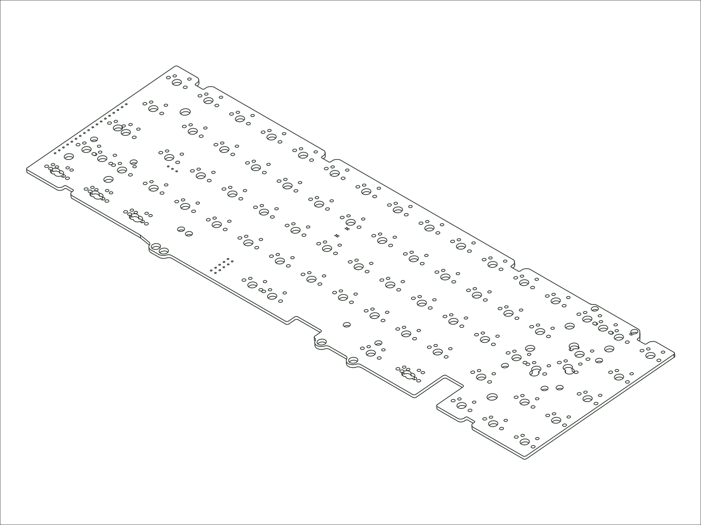

`2021 SixtyFive` `2024 SixtyFive` `Envoy` `2024 Encore`

## Availability

Not currently available to purchase or have made. Contact [support@modedesigns.com](mailto:support@modedesigns.com) for help sourcing a replacement.

## Firmware

**Designator:** `M256-WS PCB REV. ALPHA-RC2` (printed on the PCB so you can identify your revision).

**Firmware:** [mode_m256ws_via.bin :octicons-link-external-16:](https://raw.githubusercontent.com/the-via/firmware/master/mode_m256ws_via.bin){ download target="_blank" rel="noopener" }. Flash it with QMK Toolbox, then remap your keys in [VIA](https://usevia.app){ target="_blank" rel="noopener" }.

## Compatible Replacements

[65% PCB / Solder / M65S V2](./pcb-m65s-v2.md) (compatible alternative)
