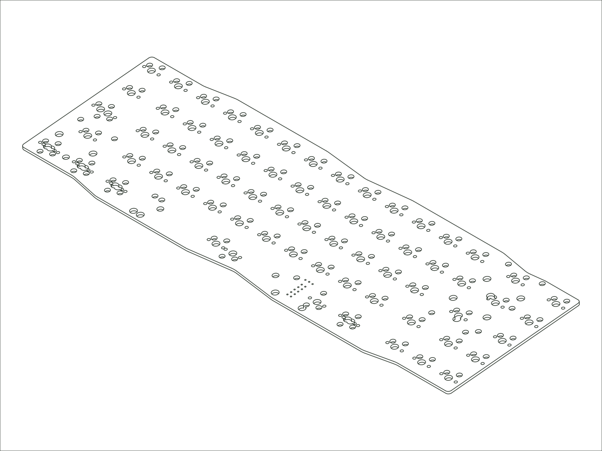

`2021 SixtyFive`

## Availability

Not currently available to purchase or have made. Contact [support@modedesigns.com](mailto:support@modedesigns.com) for help sourcing a replacement.

## Firmware

**Designator:** `M65HA rev Alpha (aug 2021)` (printed on the PCB so you can identify your revision).

**Firmware:** [mode_m65ha_alpha_via.bin :octicons-link-external-16:](https://raw.githubusercontent.com/the-via/firmware/master/mode_m65ha_alpha_via.bin){ download target="_blank" rel="noopener" }. Flash it with QMK Toolbox, then remap your keys in [VIA](https://usevia.app){ target="_blank" rel="noopener" }.

## Compatible Replacements

[65% PCB / Hotswap / M65H V2](./pcb-m65h-v2.md) (compatible alternative)
