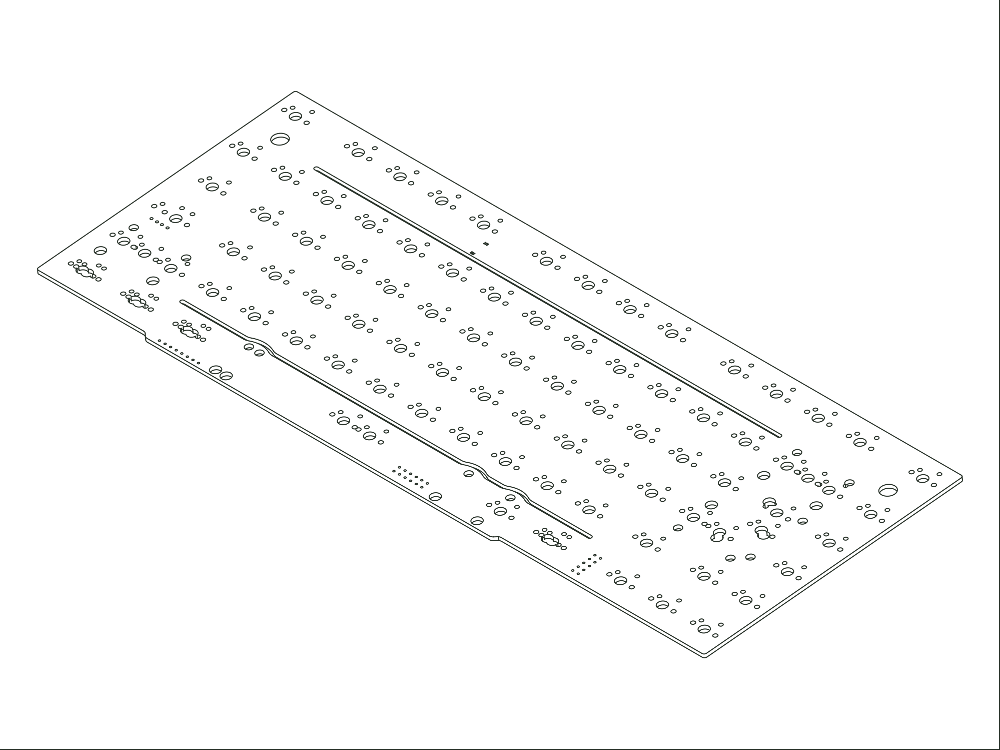

`2022 Sonnet` `2024 Sonnet`

## Availability

-   :material-store:{ .lg .middle } __Buy from Mode__

    ---

    Available for purchase directly from Mode.

    [:octicons-link-external-24: View product page](https://modedesigns.com/products/sonnet-pcb?variant=39838227660882){ target="_blank" rel="noopener" title="Buy from Mode (opens in new tab)" }

## Firmware

**Designator:** `M75S PCB rev. Alpha` (printed on the PCB so you can identify your revision).

**Firmware:** [mode_m75s_via.bin :octicons-link-external-16:](https://raw.githubusercontent.com/the-via/firmware/master/mode_m75s_via.bin){ download target="_blank" rel="noopener" }. Flash it with QMK Toolbox, then remap your keys in [VIA](https://usevia.app){ target="_blank" rel="noopener" }.

## Compatible Replacements

[75% PCB /Solder M75S-V2](./pcb-m75s-v2.md) (compatible alternative)
