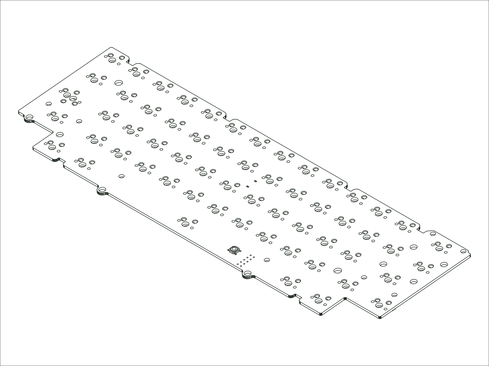

`Tempo`

## Availability

-   :material-store:{ .lg .middle } __Buy from Mode__

    ---

    Available for purchase directly from Mode.

    [:octicons-link-external-24: View product page](https://modedesigns.com/products/tempo-pcb?variant=40521429123154){ target="_blank" rel="noopener" title="Buy from Mode (opens in new tab)" }

-   :material-email:{ .lg .middle } __Request from Support__

    ---

    Contact Mode support for assistance and availability.

    [:octicons-arrow-right-24: Email support](mailto:support@modedesigns.com){ title="Email Mode support" }

## Firmware

**Firmware:** [mode_m60h_f_via.bin :octicons-link-external-16:](https://raw.githubusercontent.com/the-via/firmware/master/mode_m60h_f_via.bin){ download="mode_m60h_f_via.bin" target="_blank" rel="noopener" }. Flash it with QMK Toolbox, then remap your keys in [VIA](https://usevia.app){ target="_blank" rel="noopener" }.
