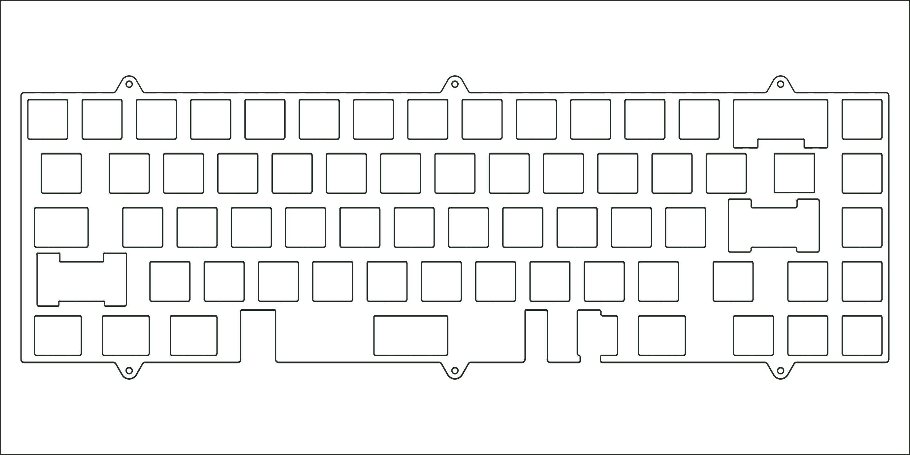

`2021 SixtyFive`

## Availability

-   :material-hammer-wrench:{ .lg .middle } __Have it Made__

    ---

    Use the Design Files below for having the part made.

    [:octicons-arrow-right-24: Design Files](#design-files){ title="Design Files" }

## Design Files

[:material-download: Plate (DXF)](../files/sixtyfive-2021-plate-ansi.dxf){ download title="Download plate DXF" }

[:material-download: Plate (STEP)](../files/sixtyfive-2021-plate-ansi.step){ download title="Download plate STEP" }

## Compatible Replacements

[2024 SixtyFive Plate / Universal](./sixtyfive-2024-plate-universal.md) - Backwards compatible plate that supports ANSI and ISO layouts
